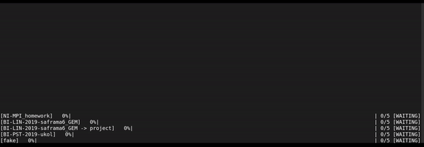

Welcome to exporter's documentation!
====================================

Exporter automates exporting projects from `FIT CTU GitLab <https://gitlab.fit.cvut.cz/>`_ to `GitHub <https://github.com/>`_.
It allows choosing which projects to export, their renaming, and visibility on GitHub.
Also, there is an option for exporting all of your GitLab projects at once.

Check Quickstart :doc:`HERE </quickstart>` for examples.

.. toctree::
   :maxdepth: 2
   :caption: Contents:

   quickstart
   projects_file_format
   config_file_format
   return_codes
   testing
   manpage
   modules

Indices and tables
==================

* :ref:`genindex`
* :ref:`modindex`
* :ref:`search`
